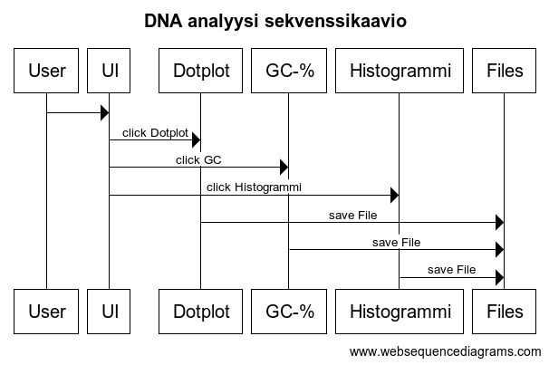

## Arkkitehtuuri

### Projektin rakenne

Projektin rakenne on jaoteltu seuraavasti:
1. src  
  * 2. files
  * 3. sovellus
  * 4. test
  * 5. ui

Src kansioiden yhdistävä pääkansio.  
Files on vastuussa tiedostojen talletuksesta ja on esimerkkitiedostojen sijainti.  
Datan käsittely ja tiedostojen lukeminen tapahtuu sovellus-kansiossa.  
Testaamiseen liittyvät toiminnot löytyy tests kansiosta.  
Ui-kansiossa on käyttöliittymän ja tulostukseen, sekä datan näyttämiseen liittyvät toiminnot.  

Alustava luokkakaavio

### Sovelluslogiikka

Sovellus käynnistyy käyttöliittymästä, joka kutsuu yksitellen käyttäjän valintojen mukaisesti Dotplot, GC ja Histogrammi -luokkia ja funktioita.  
Dotplot-luokka alustaa Sequence(), luokan, joka ajaa dotplot() funktion käyttäjän valitsemalla tiedostolla.
Dotplot-funktio prosessoi datan ja tallentaa saadun tiedoston 'sequence.png' -tiedostoon, ja näyttää sen käyttöliittymässä.
GC-funktio ajaa parsecontent ja percentages -funktiot käyttäjän valitsemalla tiedostolla, ja tulostaa saadun prosenttiluvun käyttöliittymässä.

### TODO: histogrammin sovelluslogiikka, luokka- ja sekvenssikaavion päivitys

Alustava sekvenssikaavio  

