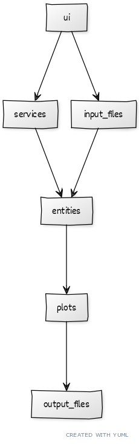

# Arkkitehtuuri

## Projektin rakenne

Projektin rakenne on jaoteltu seuraavasti:  
- `src`  
  - `input_files`
  - `output_files`
  - `services`
  - `entities`
  - `test`
    - `testfiles`
  - `ui`

Alla on selitetty projektin rakenne yksityiskohtaisemmin:  
- `src` on kansioita yhdistävä pääkansio.  
- `input_files` on esimerkkitekstitiedostojen sijainti.
- `output_files` on vastuussa tiedostojen tallentamisesta, ja esimerkkitiedostot tallennetaan sinne.
- `services` on vastuussa sovelluslogiikan eriyttämisestä käyttöliittymästä.
- Datan käsittely ja tiedostojen lukeminen tapahtuu `entities`-kansiossa.  
- Testaamiseen liittyvät toiminnot löytyy `tests` -kansiosta, ja testeihin tarvittavat tiedostot `testfiles` -kansiosta.  
- `ui`-kansiossa on käyttöliittymän ja tulostukseen, sekä datan näyttämiseen liittyvät toiminnot.  

Koodin pakkausrakenne on esitetty alla olevassa pakkauskaaviossa.

## Käyttöliittymä

Käyttöliittymällä on neljä eri näkymää ja kolme eri toimintoa:  
- Etusivu  
  - Kahden sekvenssin samanlaisuus  
  - Sekvenssin GC-% laskeminen  
  - Sekvenssien pituuksien vertailu  

Käyttöliittymän ja sovelluslogiikan toiminnot on selitetty yksityiskohtaisemmin Sovelluslogiikka -osion alla.

## Sovelluslogiikka

Tässä osiossa avataan sovelluslogiikka siten, että jokaisen käyttäjälle mahdollisen toiminnallisuuden kautta selitetään, mitä ohjelman koodissa tapahtuu.  

1. Käyttäjä haluaa selvittää valitsemistaan sekvensseistä samanlaisuuden:  
Tiedoston valitsemisen jälkeen käyttöliittymä kutsuu `DotplotService` -serviceä, joka käynnistää `dotplot_run` -funktion annetulla tiedostolla.  
`dotplot_run` alustaa `Dotplot`, luokan, joka ajaa `get_lengths` -metodin käyttäjän valitsemalla tiedostolla. `get_lengths` -metodi palauttaa datan ja tarvittavat parametrit `dotplot_run` -funktiolle, joka vie nämä `plots` -kansion `Dotplot_plot` tiedoston `dotplot_plotting` -funktiolle. Tämä metodi luo ja tallentaa tiedoston `output_files` -kansioon nimellä `dotplot.png`. Tämän jälkeen käyttöliittymä hakee `output_files` -kansiosta tämän tiedoston ja näyttää sen käyttöliittymässä.  

2. Käyttäjä haluaa selvittää valitsemastaan sekvesseistä GC-%:  
Tiedoston valitsemisen jälkeen käyttöliittymä kutsuu `GcService` -serviceä, joka käynnistää `gc_run` -funktion annetulla tiedostolla.  
`gc_run` -funktio kutsuu `gc_content` -tiedoston `parseContent` ja `percentages` funktioita tässä järjestyksessä käyttäjän valitsemalla tiedostolla. `percentages` -funktio palauttaa arvon `gc_run` -funktiolle, joka näyttää saadun arvon käyttöliittymässä.  

3. Käyttäjä haluaa vertailla valitsemistaan sekvensseistä pituuksia:  
Tiedoston valitsemisen jälkeen käyttöliittymä kutsuu `HistogramService` -serviceä, joka käynnistää `histogram_run` -funktion annetulla tiedostolla.  
`histogram_run` alustaa `Histogram`, luokan, joka ajaa `calculate_lengths`, `calculate_bins` ja `create_plot` -metodit tässä järjestyksessä käyttäjän valitsemalla tiedostolla. Nämä metodit palauttavat datan ja tarvittavat parametrit `histogram-run` -funktiolle, joka vie nämä `plots` -kansion `Histogram_plot` tiedoston `create_plot` -funktiolle. Tämä metodi luo ja tallentaa tiedoston `output_files` -kansioon nimellä `histogram.png`. Tämän jälkeen käyttöliittymä hakee `output_files` -kansiosta tämän tiedoston ja näyttää sen käyttöliittymässä.  

Koodin sovelluslogiikka on myös esitetty alla olevassa sekvenssikaaviossa.  

## Tietojen tallennus
Tietojen tallennus tapahtuu `plots` kansion `Dotplot_plot` ja `Histogram_plot` tiedostoissa. GC-% toiminnallisuus ei tallenna tiedostoa. 
Sovellus tallentaa sovelluslogiikassa mainitut oletuksena nimetyt `dotplot.png` ja `histogram.png` -tiedostot `output_files` -kansioon .png-muodossa. Nämä tiedostonimet ovat oletusarvoisia, eikä niitä voi muuttaa. Kaikki tiedostojen talletus tapahtuu `output_files` -kansiossa, eikä tätäkään voi muuttaa. Tiedostojen tallentamisformaattia ei voi myöskään muuttaa.

## Sovellukseen jääneet heikkoudet
Käyttäjän ei ole tällä hetkellä mahdollista valita tiedostonimeä, formaattia eikä vaihtaa tallentamiskansiota, vaan ne ovat oletusarvoisia.
